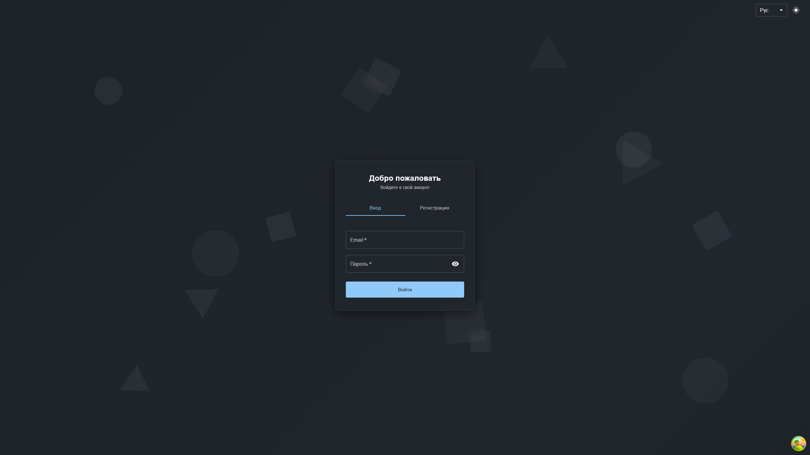

# TechSpec - Document Management

## 📸 Screenshots

### 🔐 Login Page


### 📁 Documents Dashboard


## 🚀 Quick Start

```bash
# 1. Clone repository
git clone git@github.com:yandexphp/TechSpec-DocumentManagement.git
cd TechSpec-DocumentManagement

# 2. Start all services via Docker (backend + frontend + infrastructure)
docker-compose -f infra/docker/docker-compose.yml up -d

# 3. Check container status
docker-compose -f infra/docker/docker-compose.yml ps

# 4. View logs (optional)
docker-compose -f infra/docker/docker-compose.yml logs -f

# 5. Run in production mode via Docker Swarm
# First, build images:
docker build -t documents_backend:latest -f backend/Dockerfile backend/
docker build -t documents_frontend:latest -f frontend/Dockerfile frontend/

# Then deploy stack:
docker swarm init  # if not already initialized
docker stack deploy -c infra/docker/docker-stack.yml documents

# 6. Test application
# Open in browser:
# - Frontend: http://localhost
# - Backend API: http://localhost:3000
# - Swagger: http://localhost:3000/api/docs/swagger
# - MinIO Console: http://localhost:9001 (login: minioadmin, password: minioadmin)

# 7. Stop services
docker-compose -f infra/docker/docker-compose.yml down
# or for Swarm:
docker stack rm documents
```

### Prerequisites

Make sure you have the following installed:

- [Node.js](https://nodejs.org/) 20+ 
- [Docker](https://www.docker.com/) & Docker Compose
- [Bun](https://bun.sh/) (recommended) or [npm](https://www.npmjs.com/)

### 🏃 Run with Docker (Recommended)

The fastest way to get started:

```bash
# Clone the repository
git clone git@github.com:yandexphp/TechSpec-DocumentManagement.git
cd TechSpec-DocumentManagement

# Start all services
docker-compose -f infra/docker/docker-compose.yml up -d
```

## 📦 Installation

### Local Development Setup

#### 1️⃣ Clone Repository

```bash
git clone git@github.com:yandexphp/TechSpec-DocumentManagement.git
cd TechSpec-DocumentManagement
```

#### 2️⃣ Backend Setup

```bash
cd backend

npm install

cp .env.example .env

npm run prisma:generate

npm run prisma:migrate

npm run start:dev
```

#### 3️⃣ Frontend Setup

```bash
cd frontend

bun install

cp .env.example .env

bun run dev
```

#### 4️⃣ Start Infrastructure Services

```bash
docker-compose -f infra/docker/docker-compose.yml up -d postgres redis minio
```

**🎉 Application will be available at:** http://localhost:5173

#### 5️⃣ Database Management (pgAdmin)

pgAdmin доступен для управления базой данных через браузер:

**URL:** http://localhost:5050

**Учетные данные по умолчанию:**
- Email: `admin@admin.com`
- Password: `admin`

**Подключение к PostgreSQL:**
1. После входа в pgAdmin, нажмите правой кнопкой на "Servers" → "Register" → "Server"
2. Вкладка "General":
   - Name: `Documents DB` (любое имя)
3. Вкладка "Connection":
   - Host name/address: `postgres` (имя сервиса в docker-compose)
   - Port: `5432`
   - Maintenance database: `documents_db`
   - Username: `postgres`
   - Password: `postgres` (или значение из переменной окружения `POSTGRES_PASSWORD`)

**Настройка через переменные окружения:**
```bash
PGADMIN_EMAIL=your-email@example.com
PGADMIN_PASSWORD=your-secure-password
```

---

## 🐳 Docker Deployment

### Docker Compose (Development/Staging)

```bash
# Start all services
docker-compose -f infra/docker/docker-compose.yml up -d

# Start with image rebuild
docker-compose -f infra/docker/docker-compose.yml up -d --build

# Start only infrastructure services (postgres, redis, minio, clamav, pgadmin)
docker-compose -f infra/docker/docker-compose.yml up -d postgres redis minio clamav pgadmin

# Stop all services
docker-compose -f infra/docker/docker-compose.yml down

# Stop and remove volumes
docker-compose -f infra/docker/docker-compose.yml down -v

# View logs
docker-compose -f infra/docker/docker-compose.yml logs -f

# View logs for specific service
docker-compose -f infra/docker/docker-compose.yml logs -f backend

# Check container status
docker-compose -f infra/docker/docker-compose.yml ps

# Restart service
docker-compose -f infra/docker/docker-compose.yml restart backend
```

### Docker Swarm (Production)

For high availability and scalability:

```bash
docker stack deploy -c infra/docker/docker-stack.yml documents
```

**Docker Swarm automatically:**
- 🔄 Scales backend to 3 replicas
- 🔄 Scales frontend to 2 replicas
- ⚖️ Configures load balancing via Nginx
- 🛡️ Ensures fault tolerance

**Check service status:**
```bash
docker service ls
docker service ps documents_backend
docker service ps documents_frontend
```

**View logs:**
```bash
docker service logs documents_backend
docker service logs documents_frontend
```

---

## 📚 API Documentation

### Authentication Endpoints

| Method | Endpoint | Description | Auth Required |
|--------|----------|-------------|---------------|
| `POST` | `/auth/register` | Register new user | ❌ |
| `POST` | `/auth/login` | User login | ❌ |
| `POST` | `/auth/refresh` | Refresh access token | ❌ |
| `POST` | `/auth/logout` | Logout user | ❌ |
| `GET` | `/auth/me` | Get current user info | ✅ |

### Document Endpoints

| Method | Endpoint | Description | Auth Required |
|--------|----------|-------------|---------------|
| `POST` | `/documents` | Upload document | ✅ |
| `POST` | `/documents/chunk` | Upload file chunk (for large files) | ✅ |
| `POST` | `/documents/chunk/:fileId/finalize` | Finalize chunked upload | ✅ |
| `GET` | `/documents` | List documents (query: `name`, `mimeType`, `isPrivate`, `minSize`, `maxSize`, `sortBy`, `sortOrder`, `page`, `limit`, `onlyMine`) | ✅ |
| `GET` | `/documents/:id` | Get document info | ✅ |
| `GET` | `/documents/:id/file` | Download/view document file (query: `download=true` for download) | ✅ |
| `PATCH` | `/documents/:id` | Update document (privacy) | ✅ |
| `PATCH` | `/documents/batch` | Bulk update documents | ✅ |
| `DELETE` | `/documents/:id` | Delete document (soft delete) | ✅ |

**🔒 Authentication:**

The API supports two authentication methods:

1. **Cookie-based (recommended):** Tokens are automatically sent via HTTP-only cookies
   - `accessToken` - 15 minutes expiration
   - `refreshToken` - 7 days expiration

2. **Bearer token:** Manual token in Authorization header
   ```
   Authorization: Bearer <token>
   ```

**Token refresh:**
- Call `POST /auth/refresh` to get a new access token using the refresh token
- Refresh token is automatically sent via cookie or can be provided in request body

## 🗄️ Database Schema

The database uses Prisma ORM with PostgreSQL. Key models:

### Users Table

| Column | Type | Description |
|--------|------|-------------|
| `id` | UUID | Primary key |
| `email` | String | Unique email address |
| `password` | String | Hashed password (bcrypt) |
| `nickname` | String | Unique user nickname |
| `avatarUrl` | String | Avatar image URL (nullable) |
| `createdAt` | Timestamp | Account creation date |
| `documents` | Relation | User's documents (one-to-many) |

### Documents Table

| Column | Type | Description |
|--------|------|-------------|
| `id` | UUID | Primary key |
| `originalName` | String | Original filename |
| `mimeType` | String | File MIME type |
| `size` | BigInt | File size in bytes |
| `filePath` | String | Path in MinIO storage |
| `fileURL` | String | Public access URL |
| `isPrivate` | Boolean | Privacy flag (default: true) |
| `createdAt` | Timestamp | Upload date |
| `deletedAt` | Timestamp | Soft delete date (nullable) |
| `userId` | UUID | Foreign key → users.id |
| `user` | Relation | Document owner (many-to-one) |

**Indexes:**
- `userId` + `deletedAt` - For efficient user document queries
- `userId` + `createdAt` (desc) - For sorting user documents
- `originalName` - For search functionality
- `mimeType` - For filtering by file type
- `isPrivate` - For privacy filtering

---

### Backend Tests

```bash
cd backend

# Unit tests
npm test

# Watch mode
npm run test:watch

# Coverage
npm run test:cov
```

### Frontend Tests

```bash
cd frontend

# Unit tests
bun test
# Or: npm test

# Test UI
bun run test:ui
# Or: npm run test:ui

# Coverage
bun run test:coverage
# Or: npm run test:coverage

# E2E tests
bun run test:e2e
# Or: npm run test:e2e

# E2E UI mode
bun run test:e2e:ui
# Or: npm run test:e2e:ui
```

### Backend Commands

```bash
cd backend

npm run start:dev       # Development with hot reload
npm run start:debug     # Development with debugger
npm run build           # Build for production
npm run start:prod      # Run production build
npm run prisma:generate # Generate Prisma Client
npm run prisma:migrate  # Run database migrations
npm run prisma:studio   # Open Prisma Studio (DB GUI) - http://localhost:5555
npm run lint            # Lint code with Biome
npm run format          # Format code with Biome
npm run check           # Format + lint code with Biome
npm test                # Run unit tests
npm run test:watch      # Run tests in watch mode
npm run test:cov        # Run tests with coverage
npm run test:e2e        # Run E2E tests
```

**Prisma Studio:**
After running `npm run prisma:studio`, a web interface will open at http://localhost:5555 for viewing and editing database data.

### Frontend Commands

```bash
cd frontend

# Install dependencies (Bun recommended for faster installs)
bun install
# Or use npm: npm install

bun run dev          # Development server (recommended - faster)
npm run dev          # Development server (alternative)
bun run build        # Build for production
npm run build        # Build for production (alternative)
bun run preview      # Preview production build
bun run lint         # Lint code with Biome
bun run format       # Format code with Biome
bun run check        # Format + lint code with Biome
bun run test         # Run unit tests
bun run test:ui      # Run tests with UI
bun run test:coverage # Run tests with coverage
bun run test:e2e     # Run E2E tests
bun run test:e2e:ui  # Run E2E tests with UI
```

---

## 🔧 Troubleshooting

### Docker Issues

**Containers won't start:**
```bash
# Check logs
docker-compose -f infra/docker/docker-compose.yml logs

# Rebuild images
docker-compose -f infra/docker/docker-compose.yml up -d --build

# Clear volumes and recreate
docker-compose -f infra/docker/docker-compose.yml down -v
docker-compose -f infra/docker/docker-compose.yml up -d
```

### Database Issues

**Migrations not applying:**
```bash
cd backend
npm run prisma:generate
npm run prisma:migrate
```

**Reset database:**
```bash
cd backend
npx prisma migrate reset
npm run prisma:migrate
```

---

## 📄 License

This project is licensed under the MIT License - see the [LICENSE](LICENSE) file for details.
